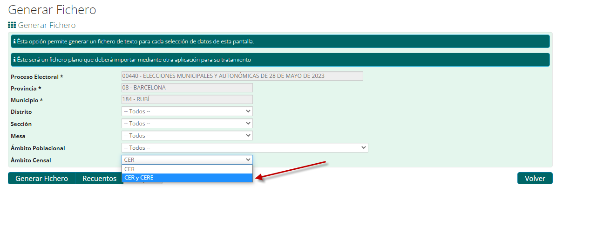
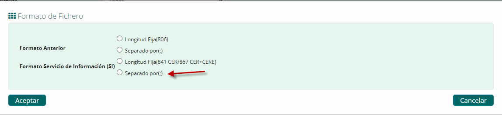
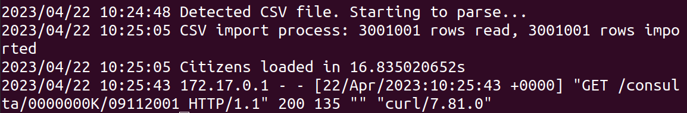

# Censo electoral INE

Microservicio de alto rendimiento para consultar la información del centro de votación de un ciudadano en unas elecciones españolas.

Agradecimientos especiales a Jesús Gomiz Gálvez del Ajuntament de Rubí por su apoyo en proporcionar el formato del Censo Electoral extraído del Instituto Nacional de Estadística para los ayuntamientos.

## ¿Cómo funciona?

TL;TR

  docker run -d -p 8080:8080 -v /ruta/a/censo:/data -e TOKEN=12345 harbor.videoatencion.com/library/censo-electoral:latest

Este microservicio analiza un archivo CSV descargado del INE. Extrae solo la información de NIF + Fecha de nacimiento + Centro de votación y crea una base de datos Sqlite con esa información. Una vez analizado, el CSV se elimina para que no se pueda obtener información adicional de él.

Si el servicio se reinicia, buscará un nuevo CSV. Si hay uno nuevo, reconstruirá la base de datos con los nuevos datos. Si no hay un nuevo CSV y existe la base de datos, iniciará el servicio.

El microservicio se ha probado en un hardware doméstico con un rendimiento excelente:

```
Tamaño de la base de datos:      3.000.000
Solicitudes paralelas:                  25
Solicitudes por segundo:               624
CPUs utilizadas:                       0.4
```


Por lo tanto, puede determinar el centro de votación a una tasa de 2,24 millones de solicitudes por hora con menos de 1 CPU y 128 MB de RAM.

## Empezando

1) Descargue el censo del INE.

  - En "Generar Fichero" deje todas las opciones en "Todos" y Ámbito Censal en "CER y CERE".

  - Seleccione "Formato Servicio de Información (SI)" Separado por (;)


 El formato del archivo exportado tiene este aspecto:
```csv
"NIE";"CPRO";"LMUN";"DIST";"SECC";"MESA";"NLOCAL";"NLOCALB";"INFADICIONAL";"DIRMESA1";"DIRMESA2";"DIRMESA3";"DIRMESA4";"NOMBRE";"APE1";"APE2";"DOMI1";"DOMI2";"DOMI3";"ENTI1";"ENTI2";"ENTI3";"CPOSTAL";"CPRON";"CNMUN";"FNAC";"SEXO";"IDENT";"CPOSTAM";"NIA";"GESCO";"NORDEN";"NACIONALIDAD";"INTENCIONVOTO";
```
  - Coloque ese archivo en una carpeta sin más archivos. La extensión debe de ser .txt o .csv.

2) Construya su docker:

    docker build . -t censo:latest
3) Ejecute el servicio:

    docker run -e TOKEN=12345 -v /ruta/al/directorio/del/censo:/data -p 8080:8080 -d censo:latest

4) Pruebe su servicio

  curl -H 'Authorization: 12345' http://127.0.0.1:8080/consulta/0000000X/25121972

```json
{"poblacion":"RUBÍ","distrito":"01","seccion":"001","mesa":"A","colele":"ESCOLA RAMON LLULL","dircol":"AV FLORS 43","errorMessage":""}
```



## Ejecutando en producción

También se proporciona un archivo docker-compose.yml para construir e iniciar el servicio. Recuerde cambiar el TOKEN, la ruta a la carpeta donde se almacena el CSV y la base de datos, además habilite HTTPS para garantizar comunicaciones seguras.

Si desea actualizar la base de datos, simplemente copie el nuevo CSV en /data y reinicie/elimine el contenedor.

**Si necesita ayuda, contáctenos en hola arroba videoatencion.com.**

---

# Censo electoral INE [ English Version ] 

High performance Microservice to return the voting center information of a citizen in a Spanish election.

Special Thanks to Jesus Gomiz Galvez from Ajuntament de Rubí for his support in providing the format of Censo Electoral extracted from the Instituto Nacional de Estadística for the city councils.

## How does it work?

TL;TR
  
  docker run -d -p 8080:8080 -v /path/to/census:/data -e TOKEN=12345 harbor.videoatencion.com/library/censo-electoral:latest

This microservice parses a CSV file downloaded from INE. It extracts just NIF + Birth Date + Polling station information and creates a Sqlite database with that information. Once parsed, the CSV is deleted so no additional information can be gathered from it.

If the service gets restarted, it will look for a new CSV. If there's a new one, it will rebuild the database with the new data. If there's no new CSV and a the database exists, it will start the service.

The microservice has been tested in commodity hardware with excellent performance:

```
Database size:          3.000.000
Parallel requests:             25
Requests per second:          624
CPUs used:                    0.4
```

So, it can determine the polling station at a rate of 2.24M requests / hour with less than 1 CPU and 128MB of RAM.


## Getting started

1) Download census from INE.

  - In "Generar Fichero" leave all options as "Todos" and Ámbito Censal to "CER y CERE".

  - Select "Formato Servicio de Información (SI)" Separado por (;)


The format will look like this:
```csv
"NIE";"CPRO";"LMUN";"DIST";"SECC";"MESA";"NLOCAL";"NLOCALB";"INFADICIONAL";"DIRMESA1";"DIRMESA2";"DIRMESA3";"DIRMESA4";"NOMBRE";"APE1";"APE2";"DOMI1";"DOMI2";"DOMI3";"ENTI1";"ENTI2";"ENTI3";"CPOSTAL";"CPRON";"CNMUN";"FNAC";"SEXO";"IDENT";"CPOSTAM";"NIA";"GESCO";"NORDEN";"NACIONALIDAD";"INTENCIONVOTO";
```
  - Place that file in a folder without any other files. The extension must be .txt or .csv.

2) Build your docker:

  - docker build . -t censo:latest

3) Run your service:

  - docker run -e TOKEN=12345 -v /path/to/census/folder:/data -p 8080:8080 -d censo:latest

4) Try your service:

  curl -H 'Authorization: 12345' http://127.0.0.1:8080/consulta/0000000X/25121972

  ```json

{"poblacion":"RUBÍ","distrito":"01","seccion":"001","mesa":"A","colele":"ESCOLA RAMON LLULL","dircol":"AV FLORS 43","errorMessage":""}
   ```


## Running in production

A docker-compose.yml is also provided to build and launch the service. Remember to change the TOKEN, the path to the folder storing the CSV and the database add enable HTTPS to ensure secure communications.

If you want to update the database, just copy the new CSV under /data and restart/delete the container.

**If you need help, contact us at hola at videoatencion.com.**


