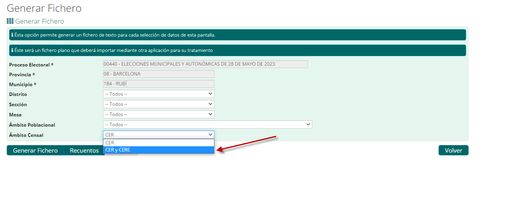
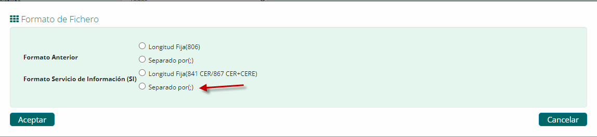
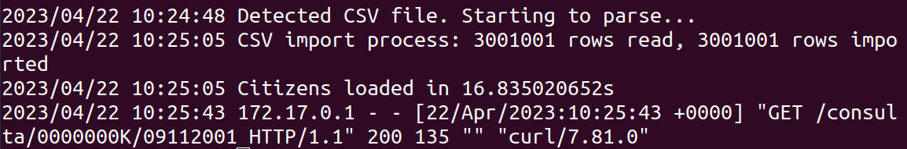

# Censo electoral INE

Microservicio de alto rendimiento para consultar la información del centro de votación de un ciudadano en unas elecciones españolas.

Agradecimientos especiales a:

  - Ajuntament de Sant Vicenç dels Horts por financiar este desarrollo.
  - Jesus Gomiz Gálvez del Ajuntament de Rubí por su apoyo en proporcionar el formato del Censo Electoral extraído del Instituto Nacional de Estadística para los ayuntamientos.
  - Miquel Estapé Valls del Consorci AOC por sus consejos en materia de seguridad y protección de datos sobre WhatsApp y Telegram.

## ¿Cómo funciona?

TL;TR
```shell
docker run -d -p 8080:8080 -v /ruta/a/censo:/data -e TOKEN=12345 harbor.videoatencion.com/library/censo-electoral:latest
```

Este microservicio analiza un archivo CSV descargado del INE. Extrae solo la información de parte del DNI, parte de la fecha de nacimiento para minimizar los datos requeridos (cumplimiento LOPD/GDPR) y los datos del Centro de votación, y crea una base de datos Sqlite con esta información. Una vez analizado, el CSV original es eliminado para que no se pueda obtener información adicional de él.

Si el servicio se reinicia, buscará un nuevo CSV. Si hay uno nuevo, reconstruirá la base de datos con los nuevos datos. Si no hay un nuevo CSV y existe la base de datos, iniciará el servicio. Si hay varios CSV (p. ej. un censo por municipio de una comarca) se importan todos en la misma base de datos.

La base de datos se construye en un fichero temporal y sólo sustituye a la anterior si la importación termina sin errores. Mientras se importa, el servicio ya escucha y `GET /health` responde 503; cuando la base de datos está lista responde 200.

El microservicio se ha probado en un hardware doméstico con un rendimiento excelente:

```
Tamaño de la base de datos:        300.000
Tiempo de importación:                9 s
Solicitudes paralelas:                  25
Solicitudes por segundo:           20.000
CPUs (límite):                           2
RAM:                                16 MB
```

## Empezando

1) Descargue el censo del INE.

  - En "Generar Fichero" deje todas las opciones en "Todos" y Ámbito Censal en "CER y CERE".

  - Seleccione "Formato Servicio de Información (SI)" Separado por (;)


 El formato del archivo exportado tiene este aspecto:
```csv
"NIE";"CPRO";"LMUN";"DIST";"SECC";"MESA";"NLOCAL";"NLOCALB";"INFADICIONAL";"DIRMESA1";"DIRMESA2";"DIRMESA3";"DIRMESA4";"NOMBRE";"APE1";"APE2";"DOMI1";"DOMI2";"DOMI3";"ENTI1";"ENTI2";"ENTI3";"CPOSTAL";"CPRON";"CNMUN";"FNAC";"SEXO";"IDENT";"CPOSTAM";"NIA";"GESCO";"NORDEN";"NACIONALIDAD";"INTENCIONVOTO";
```
  - Coloque ese archivo en una carpeta sin más archivos. La extensión debe de ser .txt o .csv.

2) Construya su docker:

   docker build . -t censo:latest

3) Analice el censo y elija qué indexar. **Indexe sólo la información mínima necesaria** (RGPD, minimización de datos): el comando `analizar` lee el censo sin importarlo ni borrarlo y propone las configuraciones mínimas que no producen colisiones, ordenadas de menos a más información personal guardada. Monte la carpeta en sólo lectura (`:ro`):

```shell
docker run --rm -v /ruta/al/directorio/del/censo:/data:ro harbor.videoatencion.com/library/censo-electoral:latest analizar
```

```
Censo analizado: 20.000 ciudadanos que votan en 180 mesas.

Opciones mínimas sin colisiones, de menos a más información personal guardada:

 1. Los últimos 5 caracteres del documento (4 cifras y la letra en un DNI), el día de nacimiento, la primera letra del primer apellido y el código postal.
    DOCUMENT_CHARS=5 DAY=true SN1=true POST_CODE=true NAME_CHARS=1
    Información guardada por ciudadano: unos 27 bits.
    Sólo con el documento se resuelve el 91,6 % de los ciudadanos; el resto tendrá que responder alguna pregunta más.
    Atención: 7 ciudadanos sin fecha de nacimiento válida quedarían fuera del índice.
 ...
```

  Copie las variables de la opción elegida al arrancar el servicio (paso 4). Para elegir entre opciones parecidas:

  - **Información guardada**: estimación de cuánto identifica lo que se guarda de cada ciudadano. Cada cifra del documento cuenta 3,3 bits, la letra del DNI 4,5, y cada campo de desempate lo que realmente distingue en *su* censo (un código postal dentro de un municipio dice poco; un año de nacimiento, bastante más).
  - **Sólo con el documento**: cuántos ciudadanos encuentran su mesa sin que se les pregunte nada más. Al resto, la web o el chatbot les pide un dato de desempate cada vez.
  - **Ciudadanos fuera del índice**: si la opción usa la fecha de nacimiento, quienes no la tienen en el censo no podrán consultar. Prefiera una opción sin fecha si son muchos.
  - Por defecto se proponen hasta 3 campos de desempate y hasta 6 caracteres del documento, porque el DNI casi entero es un identificador directo. En municipios grandes puede necesitar más campos: `analizar -max-campos 5`. Use `analizar -h` para ver todas las opciones.

  El análisis aplica exactamente las mismas reglas que la importación (los mismos recortes y la misma normalización de nombres) y sólo muestra cifras agregadas, nunca datos de ningún ciudadano. Un censo de 300.000 personas se analiza en unos 7 segundos.

4) Ejecute el servicio:

    docker run -e TOKEN=12345 -v /ruta/al/directorio/del/censo:/data -p 8080:8080 -d censo:latest
      o
    docker run -d -e TOKEN=12345 -e DOCUMENT_CHARS=5 -e FIRST_CHARS=true -e FIRST_CHARS_ADD_LETTER=true  -e NAME_CHARS=2 -e DAY=true -e YEAR=true -e FN=true -e SN1=true -e SN2=false -e POST_CODE=false -v /data:/data   harbor.videoatencion.com/library/censo-electoral:latest

    Si miráis los logs, se verá algo así:
```
    2023/04/28 10:48:13 CSV import process: 21368 rows read, 21360 rows imported
    2023/04/28 10:48:13 citizen_id+sn1 = 98.69%
    2023/04/28 10:48:13 citizen_id+day = 98.38%
    2023/04/28 10:48:13 citizen_id+fn = 98.12%
    2023/04/28 10:48:13 citizen_id+year = 92.43%
    2023/04/28 10:48:13 citizen_id = 70.74%
    2023/04/28 10:48:13 citizen_id+sn2 = 70.74%
    2023/04/28 10:48:13 citizen_id+postCode = 70.74%
    2023/04/28 10:48:13 Citizens loaded in 324.35326ms
```

  Aquí podemos ver que el proceso de importación ha funcionado sin colisiones, y el % de resoluciones que podemos esperar sólo consultando el documento de identidad o el documento y un campo adicional. Los 8 registros no importados han sido causados por filas con el campo del documento de identidad o la fecha de nacimiento vacías.


5) Pruebe su servicio

    curl -H 'Authorization: 12345' -X POST http://127.0.0.1:8080/consulta -d '{ "citizenId": "0123A", "day": "31", "year": "91", "sn1": "AL", "sn2": "MA" }'

```json
{"poblacion":"RUBÍ","distrito":"01","seccion":"001","mesa":"A","colele":"ESCOLA RAMON LLULL","dircol":"AV FLORS 43","errorMessage":""}
```
  Sólo citizenId es obligatorio, cualquier otro parámetro es opcional. Si se encuentra más de un resultado, el sistema retorna un mensaje como este:

```json
{"errorMessage":"[day year sn2]"}
```
  Esto indica qué otros campos pueden pasarse para obtener un resultado único. La lista está ordenada de más a menos útil: primero los campos que por sí solos determinan la mesa, después los que dejan menos mesas posibles y, a igualdad, los más fáciles de responder (día, año, primer apellido, segundo apellido, nombre, código postal). Basta con preguntar al ciudadano el primero; si no lo sabe, el siguiente. Los campos que no ayudan a distinguir la mesa no se incluyen, y `[colele]` significa que ningún dato del ciudadano puede deshacer el empate. Si todos los registros que coinciden votan en la misma mesa se devuelve directamente esa mesa, sin pedir más datos.

  El servicio aplica a la consulta la misma normalización que a la importación, así que se puede enviar el valor reducido o el completo: `"citizenId": "12345678-A"` equivale a `"5678A"`, `"sn1": "Álvarez"` a `"AL"`, `"day": "5"` a `"05"` y `"year": "1991"` a `"91"`. Los nombres se comparan sin acentos (À→A, Ç→C, Ñ→N). Los campos que no estén indexados se ignoran. Todos los errores se devuelven con código 200 y `errorMessage` (integración con MessageBird), excepto un token incorrecto (403) y el servicio todavía cargando (503).

  Para que el ciudadano no tenga que enviar el documento entero, `GET /formato` (con la misma cabecera `Authorization`) indica qué parte se indexa, y así el cliente puede pedir sólo esa parte:

```json
{"documentChars":5,"firstChars":false,"addLetter":false}
```




## Ejecutando en producción

También se proporciona un archivo docker-compose.yml para construir e iniciar el servicio. Recuerde cambiar el TOKEN, la ruta a la carpeta donde se almacena el CSV y la base de datos, además habilite HTTPS para garantizar comunicaciones seguras.

Si dos ciudadanos con la misma clave votan en mesas distintas (colisión) la importación se aborta, se informa de cuántas colisiones hay y se conserva el CSV y la base de datos anterior. Los duplicados que votan en la misma mesa no son un problema y se ignoran. Para no llegar a una colisión, elija la configuración con `analizar` (paso 3 de «Empezando») antes de cargar el censo.

Puede controlarse qué se indexa mediante las siguientes variables de entorno (un valor no válido detiene el servicio):

- TOKEN (obligatorio): valor de la cabecera `Authorization` (se acepta también `Bearer <token>`)
- DOCUMENT_CHARS (default=5): cuántos caracteres extrae del documento de identidad. 0 guarda el documento entero
- NAME_CHARS (default=2): número de caracteres a indexar para nombre o apellidos
- FIRST_CHARS=true (default=false): lee el documento desde el principio (true) o desde el final (false)
- FIRST_CHARS_ADD_LETTER=true (default=false): con FIRST_CHARS, añade la letra del final del documento [ 12345678A -> 12345A ]
- DAY=true (default=false): activa dd
- YEAR=true (default=false): activa yy
- FN=true (default=false): activa nombre
- SN1=true (default=false): activa apellido1
- SN2=true (default=false): activa apellido2
- POST_CODE=true (default=false): activa el código postal (columna CPOSTAM)
- TIMEZONE (default=UTC), PORT (default=8080), DATA_DIR (default=/data)

Si desea actualizar la base de datos, simplemente copie el nuevo CSV en /data y reinicie/elimine el contenedor. Una base de datos creada por una versión anterior a la 2 no se puede servir: hay que volver a cargar el CSV.

## Cliente web

[consulta-censo-electoral-web](https://github.com/videoatencion/consulta-censo-electoral-web) es una web (SPA en React) para que cualquier ciudadano consulte dónde vota. Pide sólo la parte del DNI/NIE que se indexa (la que indica `GET /formato`; si el ciudadano lo escribe entero, se recorta en el navegador) y, si hace falta desempatar, sólo la siguiente pregunta útil (usa el orden de la lista de campos descrito arriba). El nombre del ente, el logotipo, el contacto de ayuda y el enlace al trámite de reclamación del censo se configuran con un `config.json`.

La web no habla directamente con este microservicio: la sirve un nginx que hace de proxy y añade el `TOKEN`, de forma que el token nunca llega al navegador. Así, este microservicio no debe exponerse a Internet; sólo el servicio `web`:

```yaml
services:
  censo:
    image: harbor.videoatencion.com/library/censo-electoral:latest
    restart: unless-stopped
    environment:
      TOKEN: ${TOKEN:?}
      DAY: "true"
      YEAR: "true"
      SN1: "true"
      SN2: "true"
      POST_CODE: "true"
    volumes:
      - ./data:/data

  web:
    build: https://github.com/videoatencion/consulta-censo-electoral-web.git
    restart: unless-stopped
    environment:
      BACKEND_URL: http://censo:8080
      BACKEND_TOKEN: ${TOKEN:?}
    volumes:
      - ./config.json:/usr/share/nginx/html/config.json:ro
      - ./logo.svg:/usr/share/nginx/html/logo.svg:ro
    ports:
      - "8080:8080"
```

```shell
TOKEN=$(openssl rand -hex 32) docker compose up -d
```

Vea el README del cliente web para el formato de `config.json`, el límite de peticiones y el despliegue detrás de un balanceador.

**Si necesita ayuda, contáctenos en hola arroba videoatencion.com.**

---

# Censo electoral INE [ English Version ] 

High performance Microservice to return the voting center information of a citizen in a Spanish election.

Special Thanks to:

  - Ajuntament de Sant Vicenç for funding this development.
  - Jesus Gomiz Galvez from Ajuntament de Rubí for his support in providing the format of Censo Electoral extracted from the Instituto Nacional de Estadística for the city councils.
  - Miquel Estapé Valls from Consorci AOC for his advice in security and RGPD compliance on WhatsApp and Telegram.

## How does it work?

TL;TR
  
```shell
docker run -d -p 8080:8080 -v /path/to/census:/data -e TOKEN=12345 harbor.videoatencion.com/library/censo-electoral:latest
```

This microservice parses a CSV file downloaded from INE. It extracts just part of the DNI and part of the Birth Date to minimize required data (GDPR compliance) plus the information of the Polling station, then it creates a Sqlite database with that information. Once parsed, the CSV is deleted so no additional information can be gathered from it.

If the service gets restarted, it will look for a new CSV. If there's a new one, it will rebuild the database with the new data. If there's no new CSV and the database exists, it will start the service. Several CSV files (e.g. one per municipality) are all imported into the same database.

The database is built in a temporary file and replaces the previous one only when the import succeeds. While importing, the service is already listening and `GET /health` answers 503; it answers 200 once the database is ready.

The microservice has been tested in commodity hardware with excellent performance:

```
Database size:            300.000
Import time:                  9 s
Parallel requests:             25
Requests per second:       20.000
CPUs (limit):                   2
RAM:                        16 MB
```


## Getting started

1) Download census from INE.

  - In "Generar Fichero" leave all options as "Todos" and Ámbito Censal to "CER y CERE".

  - Select "Formato Servicio de Información (SI)" Separado por (;)


The format will look like this:
```csv
"NIE";"CPRO";"LMUN";"DIST";"SECC";"MESA";"NLOCAL";"NLOCALB";"INFADICIONAL";"DIRMESA1";"DIRMESA2";"DIRMESA3";"DIRMESA4";"NOMBRE";"APE1";"APE2";"DOMI1";"DOMI2";"DOMI3";"ENTI1";"ENTI2";"ENTI3";"CPOSTAL";"CPRON";"CNMUN";"FNAC";"SEXO";"IDENT";"CPOSTAM";"NIA";"GESCO";"NORDEN";"NACIONALIDAD";"INTENCIONVOTO";
```
  - Place that file in a folder without any other files. The extension must be .txt or .csv.

2) Build your docker:

    docker build . -t censo:latest

3) Analyze the census and choose what to index. **Index only the minimum information needed** (GDPR data minimization): the `analizar` command reads the census without importing or deleting it and proposes the minimal configurations that produce no collisions, from the least to the most personal information stored. Mount the folder read-only (`:ro`):

```shell
docker run --rm -v /path/to/census/folder:/data:ro harbor.videoatencion.com/library/censo-electoral:latest analizar
```

  Each option shows the environment variables to use in step 4, an estimate of the personal information stored per citizen (in bits: 3.3 per document digit, 4.5 for the DNI letter, and the real entropy of each tie-breaking field in *your* census), the share of citizens found with the document alone, and how many citizens would be left out for lacking a valid birthdate. By default it proposes up to 3 tie-breaking fields and up to 6 document characters, since a nearly complete DNI is a direct identifier; large municipalities may need `analizar -max-campos 5`. See `analizar -h`. The report only contains aggregated figures, never data about any citizen.

4) Run your service:

    docker run -e TOKEN=12345 -v /path/to/census/folder:/data -p 8080:8080 -d censo:latest
      or
    docker run -d -e TOKEN=12345 -e DOCUMENT_CHARS=5 -e FIRST_CHARS=true -e FIRST_CHARS_ADD_LETTER=true  -e NAME_CHARS=2 -e DAY=true -e YEAR=true -e FN=true -e SN1=true -e SN2=false -e POST_CODE=false -v /data:/data   harbor.videoatencion.com/library/censo-electoral:latest

    If you check the logs you will see something like this:
```
    2023/04/28 10:48:13 CSV import process: 21368 rows read, 21360 rows imported
    2023/04/28 10:48:13 citizen_id+sn1 = 98.69%
    2023/04/28 10:48:13 citizen_id+day = 98.38%
    2023/04/28 10:48:13 citizen_id+fn = 98.12%
    2023/04/28 10:48:13 citizen_id+year = 92.43%
    2023/04/28 10:48:13 citizen_id = 70.74%
    2023/04/28 10:48:13 citizen_id+sn2 = 70.74%
    2023/04/28 10:48:13 citizen_id+postCode = 70.74%
    2023/04/28 10:48:13 Citizens loaded in 324.35326ms
```

  Here we can see that the import process worked, and what % of resolutions can we expect with just the citizenId or citizenId + an optional field. The 8 rows not imported are caused by rows with citizenId or birthDate empty.

5) Try your service:

    curl -H 'Authorization: 12345' -X POST http://127.0.0.1:8080/consulta -d '{ "citizenId": "0123A", "day": "31", "year": "91", "sn1": "AL", "sn2": "MA" }'

```json
{"poblacion":"RUBÍ","distrito":"01","seccion":"001","mesa":"A","colele":"ESCOLA RAMON LLULL","dircol":"AV FLORS 43","errorMessage":""}
```
  Only citizenId is mandatory, any other parameter is optional. If more than 1 record match, the system will return a message like this:

```json
{"errorMessage":"[day year sn2]"}
```
  This indicates every possible field that could be used to get a single record. The list is ordered from most to least useful: first the fields that settle the polling table on their own, then those leaving the fewest tables and, on a tie, the easiest to answer (day, year, first surname, second surname, first name, postal code). Ask the citizen for the first one; if they do not know it, the next. Fields that do not help tell the tables apart are left out, and `[colele]` means no data the citizen can give will break the tie. If every matching record votes at the same table, that table is returned without asking for more data.

  Requests are normalised like the import, so either the reduced or the full value may be sent: `"citizenId": "12345678-A"` equals `"5678A"`, `"sn1": "Álvarez"` equals `"AL"`, `"day": "5"` equals `"05"` and `"year": "1991"` equals `"91"`. Names are compared without accents. Fields that are not indexed are ignored. Every error is returned with status 200 and `errorMessage` (MessageBird integration), except a wrong token (403) and the service still loading (503).

  So that the citizen does not have to send the whole document, `GET /formato` (with the same `Authorization` header) tells which part is indexed, so the client can ask for just that part:

```json
{"documentChars":5,"firstChars":false,"addLetter":false}
```


## Running in production

A docker-compose.yml is also provided to build and launch the service. Remember to change the TOKEN, the path to the folder storing the CSV and the database add enable HTTPS to ensure secure communications.

If two citizens with the same key vote at different tables (a collision) the import is aborted, the number of collisions is reported and both the CSV and the previous database are kept. Duplicates voting at the same table are harmless and ignored. To avoid collisions, choose the configuration with `analizar` (step 3 of "Getting started") before loading the census.

You can control what is indexed with the following environment variables (an invalid value stops the service):

- TOKEN (required): value of the `Authorization` header (`Bearer <token>` is accepted too)
- DOCUMENT_CHARS (default=5): how many characters to extract from the CitizenID. 0 stores the whole document
- NAME_CHARS (default=2): define the number of characters to index for the firstname or the surnames
- FIRST_CHARS=true (default=false): read the CitizenId from the beginning (true) or from the end (false)
- FIRST_CHARS_ADD_LETTER=true (default=false): with FIRST_CHARS, append the letter at the end of the CitizenID
- DAY=true (default=false): enable dd
- YEAR=true (default=false): enable yy
- FN=true (default=false): enable firstname
- SN1=true (default=false): enable lastname1
- SN2=true (default=false): enable lastname2
- POST_CODE=true (default=false): enable the postal code (CPOSTAM column)
- TIMEZONE (default=UTC), PORT (default=8080), DATA_DIR (default=/data)

If you want to update the database, just copy the new CSV under /data and restart/delete the container. A database built by a release older than 2 cannot be served: load the CSV again.

## Web client

[consulta-censo-electoral-web](https://github.com/videoatencion/consulta-censo-electoral-web) is a web app (React SPA) for any citizen to look up where they vote. It asks only for the indexed part of the DNI/NIE (as given by `GET /formato`; if the citizen types it whole, it is cut in the browser) and, when a tie must be broken, only the next useful question (it follows the order of the field list described above). The entity name, logo, help contact and the link to the census complaint procedure are set in a `config.json`.

The web app does not talk to this microservice directly: it is served by an nginx that proxies the requests and adds the `TOKEN`, so the token never reaches the browser. This microservice must therefore not be exposed to the Internet; only the `web` service is:

```yaml
services:
  censo:
    image: harbor.videoatencion.com/library/censo-electoral:latest
    restart: unless-stopped
    environment:
      TOKEN: ${TOKEN:?}
      DAY: "true"
      YEAR: "true"
      SN1: "true"
      SN2: "true"
      POST_CODE: "true"
    volumes:
      - ./data:/data

  web:
    build: https://github.com/videoatencion/consulta-censo-electoral-web.git
    restart: unless-stopped
    environment:
      BACKEND_URL: http://censo:8080
      BACKEND_TOKEN: ${TOKEN:?}
    volumes:
      - ./config.json:/usr/share/nginx/html/config.json:ro
      - ./logo.svg:/usr/share/nginx/html/logo.svg:ro
    ports:
      - "8080:8080"
```

```shell
TOKEN=$(openssl rand -hex 32) docker compose up -d
```

See the web client README for the `config.json` format, rate limiting and deployment behind a load balancer.

**If you need help, contact us at hola at videoatencion.com.**

